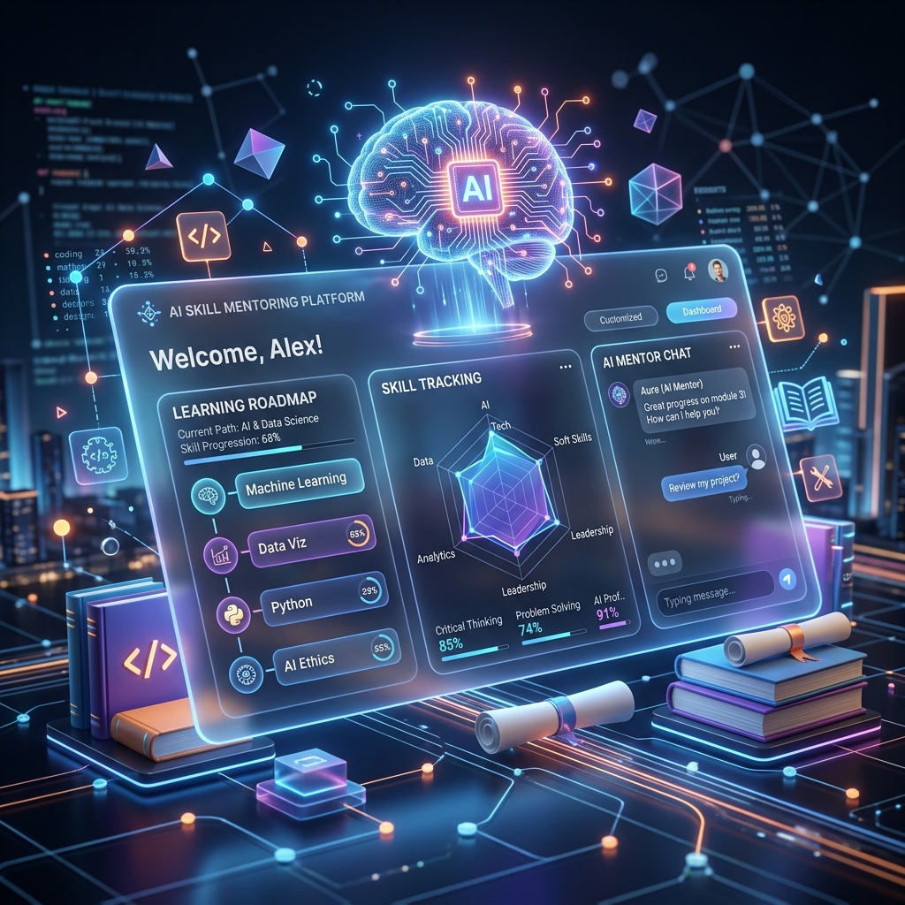

# 🚀 SkillMentor AI



**SkillMentor AI** is a cutting-edge, full-stack AI learning platform that transforms a learner's raw goal into a highly personalized, interactive, and guided study system. It combines dynamic roadmaps, tailored lessons, intelligent doubt-solving, real-time voice interaction, Socratic code coaching, career preparation, and comprehensive analytics into a single, cohesive product.

---

## ✨ Core Features & Learner Experience

- 🗺️ **Personalized Roadmaps**: AI-generated skill roadmaps dynamically planned based on learner level, ultimate goal, and available study time.
- 📖 **Interactive Lessons**: Structured learning materials packed with explanations, relatable analogies, context-aware code examples, and active practice sessions.
- 🤔 **Real-time Doubt Solving**: Context-aware AI agents available during lessons to answer questions and clarify concepts instantly.
- 💻 **Socratic Code Coach**: A built-in code playground that generates specific challenges, provides intelligent hints, evaluates solutions, and explains errors without just giving away the answer.
- 🎯 **Assessments & Review**: Adaptive quizzes, comprehensive progress tracking, detailed report cards, and a spaced repetition system for long-term retention.
- 🔥 **Gamification & Engagement**: Daily challenges, notifications, leaderboards, and streak-style engagement loops to keep learners motivated.
- 💼 **Career & Project Mentorship**: Resume review, mock interview practice, job readiness tracking, project mentoring, and verifiable certificates.
- 🎙️ **Voice Learning**: Seamless voice interaction over WebSocket for hands-free tutoring and conversational learning.
- 📚 **RAG-Powered Learning**: Upload your own study materials, books, or documents for grounded, contextual learning and querying.
- 📊 **Admin & Analytics**: Deep user analytics and comprehensive admin dashboards for engagement insights.

---

## 🏗️ Architecture & AI Agent Layer

The backend orchestration is powered by an advanced multi-agent architecture, moving beyond a single monolithic prompt handler. Each capability is powered by a specialized agent:

- `Roadmap Architect` 🏗️
- `Lesson Teacher` 🧑‍🏫
- `Doubt Solver` 🕵️
- `Quiz Examiner` 📝
- `Code Coach` 👨‍💻
- `Progress Tracker` 📈
- `Daily Challenge Coach` 🏆
- `Project Mentor` 🛠️
- `Career Prep` 💼

**Supporting services handle:** Document chunking & RAG processing, Text-to-Speech (TTS), secure notifications, user notes, dynamic certificate generation, and deep analytics.

---

## 🛠️ Tech Stack

### 🎨 Frontend
- **Framework**: [Next.js 16](https://nextjs.org/) (App Router)
- **UI Library**: [React 19](https://react.dev/)
- **Language**: TypeScript
- **Styling**: [Tailwind CSS 4](https://tailwindcss.com/)
- **Auth & Data**: [Supabase](https://supabase.com/) SSR & Auth Helpers

### ⚙️ Backend
- **Framework**: [FastAPI](https://fastapi.tiangolo.com/) with Uvicorn
- **AI Engine**: Google Gemini 3.1 Flash Lite Preview (`google-genai`)
- **Orchestration**: [LangGraph](https://langchain-ai.github.io/langgraph/) & LangChain Core
- **Data Validation**: Pydantic v2 & Pydantic-Settings
- **Database**: Supabase Python Client
- **Real-time**: WebSocket integration for voice and streaming sessions

### ☁️ Infrastructure
- **Auth & Database**: Supabase (PostgreSQL)
- **Database Schema**: Fully versioned SQL schemas under `backend/scripts`

---

## 📂 Project Structure

```text
Skill Mentor AI/
├── backend/
│   ├── app/
│   │   ├── agents/      # Core AI Agent Logic
│   │   ├── api/routes/  # FastAPI Endpoints
│   │   ├── core/        # Config, Logging, Middleware
│   │   ├── models/      # Pydantic & DB Models
│   │   └── services/    # RAG, TTS, Analytics
│   ├── scripts/         # SQL schemas & DB migrations
│   └── requirements.txt
├── frontend/
│   ├── public/
│   ├── src/
│   │   ├── app/         # Next.js App Router Pages
│   │   ├── components/  # Reusable UI Components
│   │   ├── hooks/       # Custom React Hooks
│   │   ├── lib/         # Utils & API Clients
│   │   └── types/       # TypeScript Definitions
│   └── package.json
└── skill_mentor_ai_hero.png
```

---

## 🚀 Getting Started (Local Development)

### 1. Clone the Repository
```bash
git clone <your-repo-url>
cd "Skill Mentor AI"
```

### 2. Environment Setup

**Backend (`backend/.env`)**
```env
gemini_api_key=your_gemini_api_key
supabase_url=your_supabase_url
supabase_service_key=your_supabase_service_role_key
frontend_url=http://localhost:3000
app_env=development
allow_start_without_gemini=false
admin_api_key=your_admin_api_key
admin_allowed_emails=admin@example.com
gemini_model=gemini-3.1-flash-lite-preview
gemini_embed_model=text-embedding-004
chunk_size_tokens=512
chunk_overlap_tokens=64
rag_top_k=5
```

**Frontend (`frontend/.env.local`)**
```env
NEXT_PUBLIC_SUPABASE_URL=your_supabase_url
NEXT_PUBLIC_SUPABASE_ANON_KEY=your_supabase_anon_key
NEXT_PUBLIC_API_URL=http://localhost:8000
BACKEND_API_URL=http://localhost:8000
NEXT_PUBLIC_APP_URL=http://localhost:3000
ADMIN_API_KEY=your_admin_api_key
ADMIN_ALLOWED_EMAILS=admin@example.com
```

### 3. Start the Backend API
Create and activate a virtual environment, then install the dependencies.
```bash
cd backend
python -m venv .venv
# Windows:
.venv\Scripts\activate
# macOS/Linux:
# source .venv/bin/activate

pip install -r requirements.txt
python -m uvicorn app.main:app --reload --host 127.0.0.1 --port 8000
```
> The API will be available at `http://localhost:8000`. You can check health at `http://localhost:8000/health`.

### 4. Start the Frontend App
Open a new terminal session.
```bash
cd frontend
npm install
npm run dev
```
> The frontend application will be running at `http://localhost:3000`.

---

## 🧪 Useful Commands

**Backend:**
- Run Server: `python -m uvicorn app.main:app --reload`
- Run Tests: `pytest`

**Frontend:**
- Start Dev Server: `npm run dev`
- Build for Production: `npm run build`
- Run Linter: `npm run lint`

---

## 📜 License

[MIT License](LICENSE)
