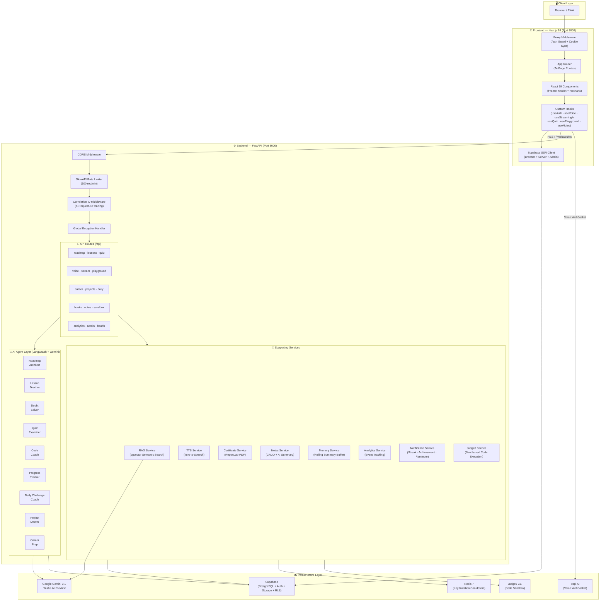
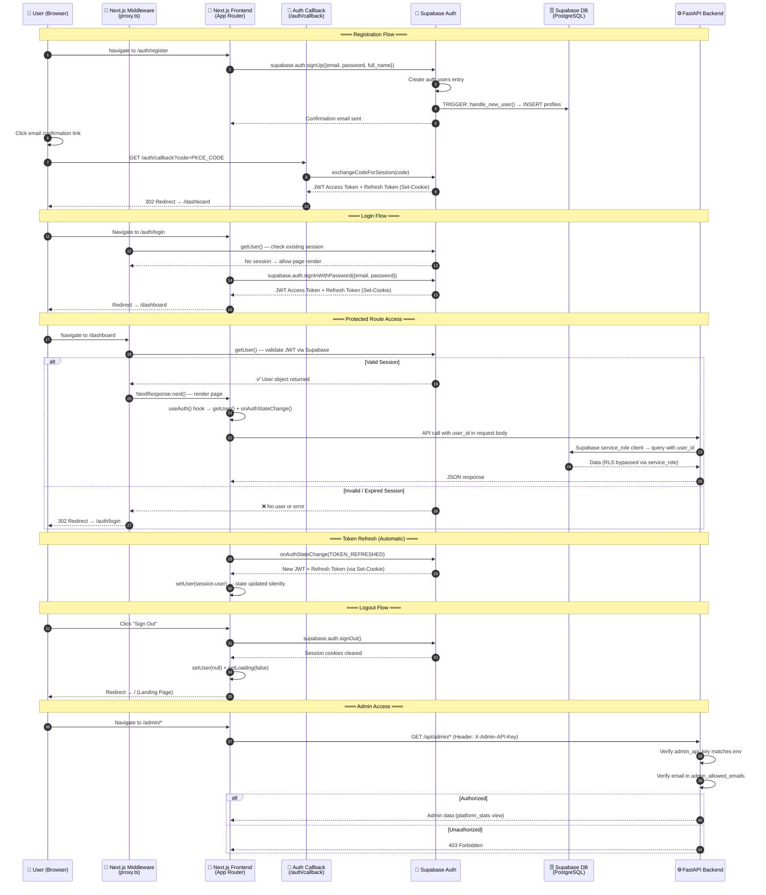
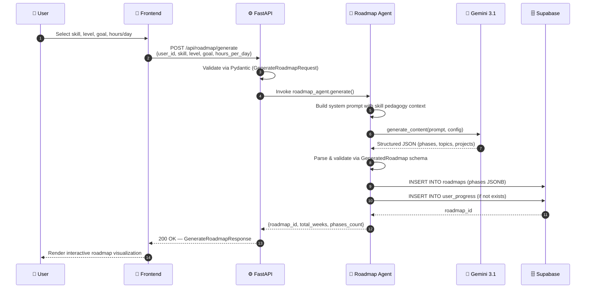
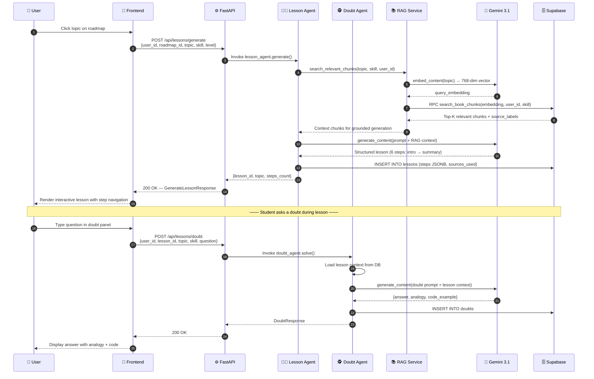
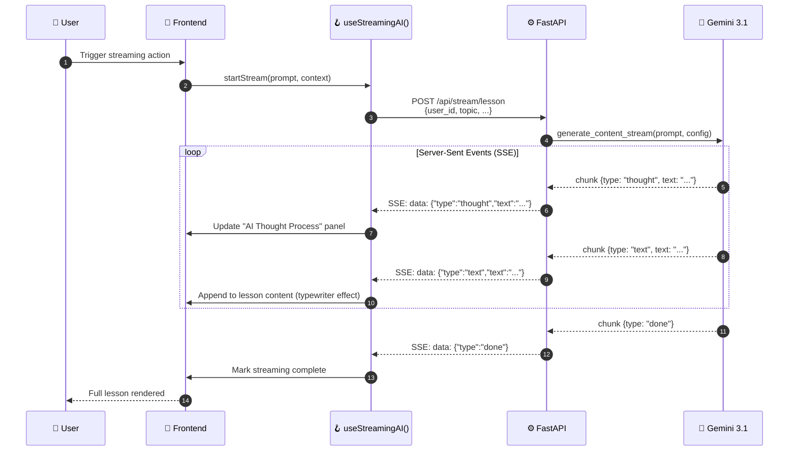
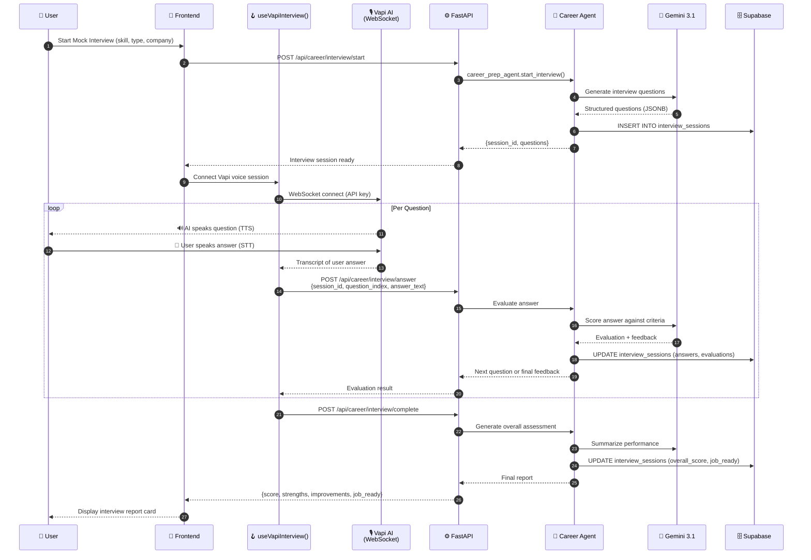
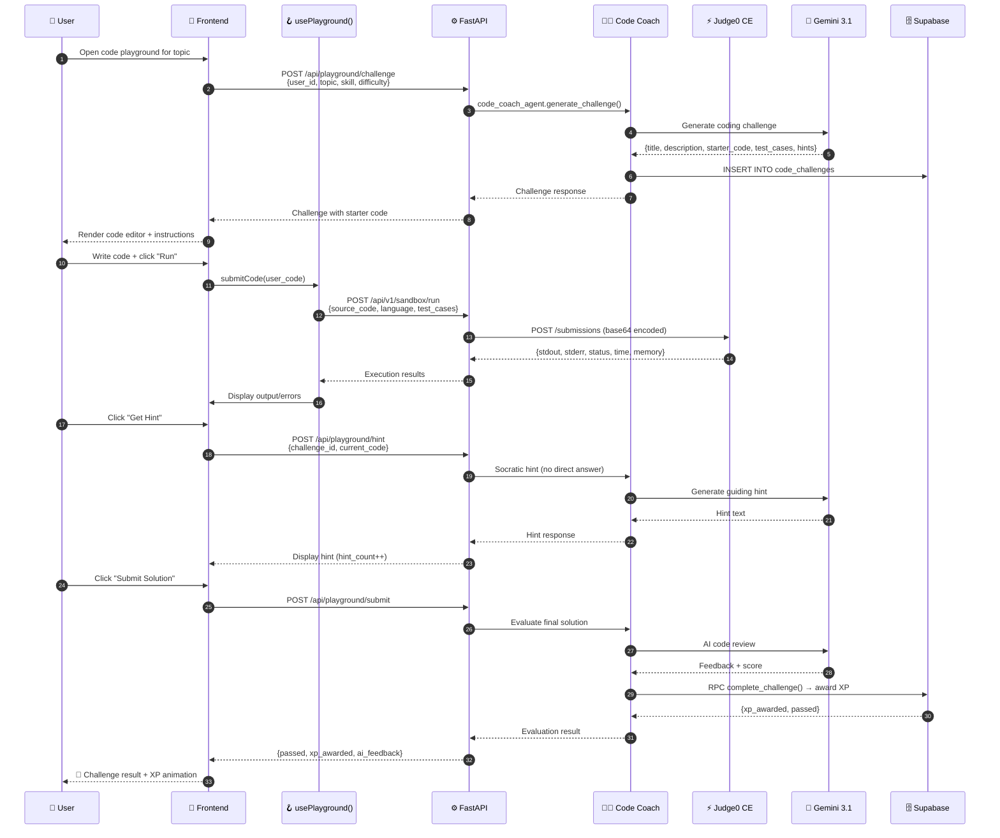

# 🏗️ SkillMentor AI — Architecture Documentation

> **Version:** 4.0.0  
> **Last Updated:** July 2026  
> **Stack:** Next.js 16 · FastAPI · Google Gemini 3.1 · LangGraph · Supabase (PostgreSQL)

---

## Table of Contents

1. [High-Level Architecture Diagram](#1-high-level-architecture-diagram)
2. [ER Diagram (Entity-Relationship)](#2-er-diagram-entity-relationship)
3. [Authentication Flow](#3-authentication-flow)
4. [Request / Sequence Flow](#4-request--sequence-flow)
5. [Technology Decision Sheet](#5-technology-decision-sheet)

> **🔍 Interactive Viewer:** Open **[diagrams.html](./diagrams.html)** in your browser for **zoomable, pannable, fullscreen** versions of all diagrams below. Supports scroll-to-zoom, drag-to-pan, touch pinch-zoom, and keyboard shortcuts.

---

## 1. High-Level Architecture Diagram

### Architecture Summary

| Layer | Technology | Responsibility |
|-------|-----------|----------------|
| **Client** | Browser / PWA | User interface rendering |
| **Frontend** | Next.js 16 + React 19 + TypeScript | SSR/CSR pages, auth guard, real-time hooks |
| **Middleware** | Next.js Proxy Middleware | Route protection, Supabase cookie synchronization |
| **Backend API** | FastAPI + Uvicorn | REST endpoints, WebSocket voice sessions, rate limiting |
| **AI Orchestration** | LangGraph + LangChain Core | Multi-agent coordination, prompt routing |
| **AI Engine** | Google Gemini 3.1 Flash Lite Preview | Content generation, embeddings, streaming |
| **LLM Router** | LiteLLM + Multi-Key Rotation | API key pooling with cooldown/failover |
| **Database** | Supabase (PostgreSQL 15+) | Data persistence, RLS, pgvector, stored procedures |
| **Auth** | Supabase Auth (PKCE) | Email/password, OAuth, JWT token management |
| **Caching** | Redis 7 Alpine | Rate-limit state, key rotation cooldowns |
| **Code Execution** | Judge0 CE (Community Edition) | Sandboxed code evaluation for playground |
| **Voice** | Vapi AI SDK (@vapi-ai/web) | Real-time voice interview & tutoring |
| **Deployment** | Render (Backend) + Docker Compose | Production hosting, CI/CD auto-deploy |

---

## 2. ER Diagram (Entity-Relationship)

```mermaid
erDiagram
    auth_users ||--|| profiles : "1:1 auto-created"
    profiles ||--o{ roadmaps : "has many"
    profiles ||--o{ lessons : "has many"
    profiles ||--o{ quizzes : "has many"
    profiles ||--o{ user_books : "uploads"
    profiles ||--|| user_progress : "has one"
    profiles ||--o{ voice_sessions : "has many"
    profiles ||--o{ doubts : "has many"
    profiles ||--o{ code_challenges : "has many"
    profiles ||--o{ spaced_repetition : "has many"
    profiles ||--o{ report_cards : "has many"
    profiles ||--o{ projects : "has many"
    profiles ||--o{ interview_sessions : "has many"
    profiles ||--o{ resumes : "has many"
    profiles ||--o{ certificates : "earns"
    profiles ||--o{ daily_challenges : "has many"
    profiles ||--o{ notifications : "receives"
    profiles ||--o{ user_notes : "writes"
    profiles ||--o{ user_memory : "has many"
    profiles ||--o{ analytics_events : "generates"
    profiles ||--o{ study_buddy_sessions : "hosts"

    roadmaps ||--o{ lessons : "contains"
    roadmaps ||--o{ quizzes : "generates"
    roadmaps ||--o{ code_challenges : "generates"
    roadmaps ||--o{ projects : "assigns"
    roadmaps ||--o{ interview_sessions : "scoped to"
    roadmaps ||--o{ resumes : "scoped to"
    roadmaps ||--o{ report_cards : "weekly for"
    roadmaps ||--o{ voice_sessions : "scoped to"
    roadmaps ||--o{ spaced_repetition : "tracks"
    roadmaps ||--o{ daily_challenges : "scoped to"

    lessons ||--o{ quizzes : "generates"
    lessons ||--o{ doubts : "context for"
    lessons ||--o{ voice_sessions : "context for"
    lessons ||--o{ code_challenges : "linked to"
    lessons ||--o{ user_notes : "annotated in"

    user_books ||--o{ book_chunks : "chunked into"

    quizzes ||--o{ study_buddy_sessions : "shared in"

    auth_users {
        uuid id PK
        text email
        jsonb raw_user_meta_data
    }

    profiles {
        uuid id PK, FK
        text full_name
        text email
        text avatar_url
        text current_skill
        boolean onboarding_completed
        text preferred_language
        text ui_language
        text timezone
    }

    roadmaps {
        uuid id PK
        uuid user_id FK
        text skill
        text level
        text goal
        float hours_per_day
        int total_weeks
        int current_week
        text current_phase
        text current_topic
        jsonb phases
        text daily_schedule
        text final_project
        jsonb job_readiness_checklist
    }

    lessons {
        uuid id PK
        uuid roadmap_id FK
        uuid user_id FK
        text topic
        int week_number
        int phase_number
        jsonb steps
        jsonb sources_used
        text audio_url
        text pdf_notes_url
        boolean completed
        text key_takeaway
        text next_topic
    }

    quizzes {
        uuid id PK
        uuid lesson_id FK
        uuid roadmap_id FK
        uuid user_id FK
        text topic
        text skill
        int week_number
        text difficulty
        text quiz_type
        jsonb questions
        jsonb user_answers
        jsonb results
        int score
        int total_questions
        int time_limit_secs
        int time_taken_secs
        boolean completed
        int xp_awarded
    }

    user_books {
        uuid id PK
        uuid user_id FK
        text file_name
        text file_path
        text skill_tag
        text processing_status
        int total_chunks
        jsonb topics_detected
        boolean is_curated
    }

    book_chunks {
        uuid id PK
        uuid book_id FK
        uuid user_id FK
        text skill_tag
        int chunk_index
        text content
        vector embedding
        text source_label
    }

    user_progress {
        uuid id PK
        uuid user_id FK
        int xp_points
        int streak_days
        date last_active_date
        int lessons_completed
        int quizzes_completed
        int total_study_minutes
        jsonb topic_mastery
        jsonb badges_earned
        int challenges_completed
        jsonb weak_topics
        jsonb strong_topics
        int total_hints_used
    }

    voice_sessions {
        uuid id PK
        uuid user_id FK
        uuid lesson_id FK
        uuid roadmap_id FK
        text topic
        text skill
        int duration_seconds
        text transcript
        int interruptions
        text status
    }

    doubts {
        uuid id PK
        uuid user_id FK
        uuid lesson_id FK
        text topic
        text skill
        text question
        text answer
        text analogy
        text code_example
        boolean helpful
    }

    code_challenges {
        uuid id PK
        uuid lesson_id FK
        uuid roadmap_id FK
        uuid user_id FK
        text topic
        text skill
        text title
        text description
        text starter_code
        text solution_code
        jsonb test_cases
        text difficulty
        text language
        jsonb hints
        int hints_used
        text user_code
        boolean passed
        int attempts
        text ai_feedback
        int xp_awarded
    }

    spaced_repetition {
        uuid id PK
        uuid user_id FK
        text topic
        text skill
        uuid roadmap_id FK
        float ease_factor
        int interval_days
        int repetitions
        int quality
        timestamptz next_review_at
    }

    report_cards {
        uuid id PK
        uuid user_id FK
        uuid roadmap_id FK
        int week_number
        text skill
        text summary
        jsonb strengths
        jsonb weaknesses
        jsonb recommendations
        int lessons_completed
        int quizzes_completed
        int challenges_completed
        float avg_quiz_score
        int study_minutes
        int xp_earned
        text overall_grade
        text pdf_url
    }

    projects {
        uuid id PK
        uuid roadmap_id FK
        uuid user_id FK
        text skill
        text level
        text title
        text description
        jsonb requirements
        jsonb tech_stack
        jsonb starter_hints
        text expected_outcome
        text submitted_code
        text github_url
        jsonb review
        int score
        text grade
        text status
        int xp_awarded
    }

    interview_sessions {
        uuid id PK
        uuid user_id FK
        uuid roadmap_id FK
        text skill
        text level
        text status
        text interview_type
        text company_target
        jsonb questions
        jsonb answers
        jsonb evaluations
        int overall_score
        text overall_feedback
        boolean job_ready
        int xp_awarded
    }

    resumes {
        uuid id PK
        uuid user_id FK
        uuid roadmap_id FK
        text skill
        text raw_text
        text full_name
        jsonb skills
        jsonb projects
        jsonb experience
        jsonb education
        int ats_score
        text ai_verdict
        jsonb critique
        jsonb suggestions
        text pdf_url
    }

    certificates {
        uuid id PK
        uuid user_id FK
        uuid roadmap_id FK
        text skill
        text level
        text full_name
        text verify_code
        text pdf_url
        int xp_at_issue
    }

    daily_challenges {
        uuid id PK
        uuid user_id FK
        uuid roadmap_id FK
        text skill
        date challenge_date
        text title
        text description
        text type
        jsonb content
        boolean completed
        int xp_awarded
    }

    notifications {
        uuid id PK
        uuid user_id FK
        text type
        text title
        text message
        boolean read
        text action_url
    }

    user_notes {
        uuid id PK
        uuid user_id FK
        uuid lesson_id FK
        uuid roadmap_id FK
        text skill
        text topic
        int step_index
        text step_title
        text content
        text ai_summary
        text_array tags
    }

    user_memory {
        uuid id PK
        uuid user_id FK
        text session_summary
        text_array topics
    }

    analytics_events {
        uuid id PK
        uuid user_id FK
        text event_type
        jsonb event_data
        text session_id
        text page
    }

    study_buddy_sessions {
        uuid id PK
        uuid host_user_id FK
        uuid guest_user_id FK
        text skill
        text session_code
        text status
        uuid shared_quiz_id FK
        int host_score
        int guest_score
    }
```

### Entity Summary

| Entity | Description | Key Relationships |
|--------|-------------|-------------------|
| **profiles** | Extends `auth.users` with learning metadata | 1:1 with auth, 1:N with all learning entities |
| **roadmaps** | AI-generated personalized learning plans | Parent of lessons, quizzes, projects |
| **lessons** | Topic-based structured learning content | Contains steps (JSONB), generates quizzes |
| **quizzes** | Adaptive assessments (lesson/weekly/spaced) | Linked to lessons and roadmaps |
| **user_books** | Uploaded PDF documents for RAG | Chunked into `book_chunks` with embeddings |
| **book_chunks** | Vector-embedded text chunks (768-dim) | Powers semantic search via pgvector |
| **user_progress** | Aggregated XP, streaks, mastery stats | Single row per user |
| **code_challenges** | Socratic coding problems with AI hints | Linked to lessons, tracks attempts |
| **spaced_repetition** | SM-2 algorithm for long-term retention | Unique per (user, topic, skill) |
| **report_cards** | Weekly performance summaries | Generated per (user, roadmap, week) |
| **projects** | Capstone projects with AI review | Assigned → In Progress → Submitted → Reviewed |
| **interview_sessions** | Mock interview sessions (4 types) | Technical, behavioral, mixed, system design |
| **resumes** | AI-reviewed résumés with ATS scoring | One per (user, roadmap) |
| **certificates** | Verifiable completion certificates | Public verification via `verify_code` |
| **daily_challenges** | Gamified daily tasks | One per user per day |
| **notifications** | In-app notifications (6 types) | Streak milestones auto-generated via trigger |
| **user_notes** | Learner annotations on lessons | Full-text search via GIN index |
| **user_memory** | Agent conversation memory buffer | Rolling summaries for context continuity |
| **analytics_events** | Behavioral event tracking | Feeds admin dashboard and `platform_stats` view |
| **study_buddy_sessions** | Collaborative quiz sessions | Host + Guest, shared quiz scoring |

---

## 3. Authentication Flow

### Authentication Architecture Highlights

| Aspect | Implementation |
|--------|---------------|
| **Auth Provider** | Supabase Auth (GoTrueJS) |
| **Auth Method** | Email/Password with PKCE code exchange |
| **Token Format** | JWT (Access Token) + Refresh Token |
| **Session Storage** | HTTP-only cookies managed by `@supabase/ssr` |
| **Client-Side Auth** | `createBrowserClient()` — singleton with `persistSession: true`, `autoRefreshToken: true` |
| **Server-Side Auth** | `createServerClient()` — async cookie store for Next.js 16 Server Components |
| **Middleware Guard** | `proxy.ts` protects `/dashboard`, `/onboarding`, `/roadmap`, `/lesson` |
| **Auth Redirect** | Logged-in users hitting `/auth/*` are redirected to `/dashboard` |
| **Backend Auth** | Service role key (bypasses RLS) — user_id passed in request body |
| **Admin Auth** | API key (`X-Admin-API-Key`) + email whitelist (`admin_allowed_emails`) |
| **Profile Auto-Creation** | PostgreSQL trigger on `auth.users` INSERT → creates `profiles` row |
| **Row Level Security** | All 20+ tables enforce `auth.uid() = user_id` via RLS policies |

---

## 4. Request / Sequence Flow

### 4a. Roadmap Generation Flow

### 4b. Lesson + Doubt Solving Flow (with RAG)

### 4c. Streaming AI Response Flow

### 4d. Voice Interview Flow

### 4e. Code Playground (Socratic Coach) Flow

---

## 5. Technology Decision Sheet

### 5.1 Frontend Decisions

| Decision | Choice | Alternatives Considered | Rationale |
|----------|--------|------------------------|-----------|
| **Framework** | Next.js 16 (App Router) | Vite + React, Remix, Nuxt | SSR + API routes + built-in middleware; App Router enables server components for auth & data fetching |
| **UI Library** | React 19 | Svelte 5, Vue 3 | Ecosystem maturity, hooks model, concurrent features, excellent Supabase integration |
| **Language** | TypeScript | JavaScript | Type safety across 24 page routes, auto-completion for Supabase types, catch errors at build time |
| **Styling** | Tailwind CSS 4 | CSS Modules, Styled Components, Chakra UI | Utility-first approach allows rapid prototyping; v4 brings native CSS cascade layers |
| **Animation** | Framer Motion 12 | GSAP, React Spring, CSS Keyframes | Declarative API fits React paradigm, layout animations, gesture support, exit animations |
| **Charts** | Recharts 3 | Chart.js, D3.js, Nivo | Composable React components, responsive by default, good for progress/analytics dashboards |
| **Markdown** | react-markdown + rehype-highlight + remark-gfm | MDX, marked | Renders AI-generated lesson content safely with syntax highlighting for code blocks |
| **Toast Notifications** | Sonner 2 | react-hot-toast, Notistack | Lightweight, beautiful defaults, stacking support, promise-based toasts |
| **Icons** | Lucide React | Heroicons, Phosphor, React Icons | Tree-shakeable, consistent design language, 1000+ icons, maintained |
| **Theme** | next-themes | Custom solution | Dark/light mode with zero-flash, SSR-compatible, localStorage persistence |
| **Testing** | Vitest + Testing Library | Jest, Cypress | Native Vite integration, faster than Jest, same Testing Library API |
| **Voice SDK** | @vapi-ai/web 2.5 | Web Speech API, Deepgram | Production-ready WebSocket voice with STT + TTS, low latency, easy integration |

### 5.2 Backend Decisions

| Decision | Choice | Alternatives Considered | Rationale |
|----------|--------|------------------------|-----------|
| **Framework** | FastAPI | Django REST, Flask, Express.js | Async-native, automatic OpenAPI docs, Pydantic integration, WebSocket support, high performance |
| **ASGI Server** | Uvicorn (Standard) | Gunicorn + Uvicorn workers, Hypercorn | Default for FastAPI, HTTP/2 support, auto-reload in dev, production-ready with `--workers` |
| **AI Engine** | Google Gemini 3.1 Flash Lite Preview | GPT-4o-mini, Claude 3.5 Haiku, Llama 3 | Cost-effective, fast inference, native thinking mode, 768-dim embeddings, Google ecosystem |
| **AI Orchestration** | LangGraph + LangChain Core | CrewAI, AutoGen, Raw Gemini SDK | State machine for multi-step agent flows, built-in checkpointing, LangChain ecosystem compatibility |
| **LLM Routing** | Custom LLMRouter + LiteLLM | LangChain LLM wrappers, Direct SDK | Multi-key rotation with cooldown/failover, transparent provider switching, rate-limit awareness |
| **Data Validation** | Pydantic v2 + Pydantic-Settings | Marshmallow, Cerberus, attrs | Native FastAPI integration, Settings from env files, 5-50x faster than v1, JSON Schema support |
| **PDF Processing** | PyMuPDF + Docling | PDFMiner, pdfplumber, PyPDF2 | Fast extraction, image-aware, Docling for advanced document understanding |
| **PDF Generation** | ReportLab | WeasyPrint, FPDF, Playwright | Programmatic PDF creation for certificates and report cards, no browser dependency |
| **Rate Limiting** | SlowAPI (100 req/min) | Custom middleware, FastAPI-Limiter | Redis-backed, decorator-based, Starlette-compatible, production-tested |
| **HTTP Client** | httpx | aiohttp, requests | Async-first, HTTP/2, timeout control, used for Judge0 API calls |
| **Retry Logic** | Tenacity | backoff, custom retry | Decorator-based, configurable strategy, works with async, production battle-tested |
| **Code Execution** | Judge0 CE (Community Edition) | Piston, Sphere Engine, Docker sandbox | Free hosted sandbox, 60+ languages, stdin/stdout capture, memory/time limits |
| **Tokenization** | tiktoken | SentencePiece, HuggingFace Tokenizers | Fast BPE tokenizer for chunk size calculation in RAG pipeline |

### 5.3 Infrastructure Decisions

| Decision | Choice | Alternatives Considered | Rationale |
|----------|--------|------------------------|-----------|
| **Database** | Supabase (PostgreSQL 15+) | Firebase, PlanetScale, Neon | PostgreSQL with pgvector, built-in Auth, Storage, RLS, realtime subscriptions, generous free tier |
| **Vector Search** | pgvector (IVFFlat, 768-dim) | Pinecone, Weaviate, Qdrant, ChromaDB | No external service needed, co-located with relational data, cosine similarity, IVFFlat index |
| **Authentication** | Supabase Auth (GoTrue) | Auth0, Clerk, NextAuth.js | Integrated with DB (RLS policies reference `auth.uid()`), PKCE flow, email/password + OAuth |
| **File Storage** | Supabase Storage | AWS S3, Cloudflare R2, GCS | Integrated with Supabase Auth policies, CDN delivery, bucket-level access control |
| **Caching** | Redis 7 Alpine | Memcached, Supabase Edge Cache | Key rotation cooldowns, rate limit state, session caching, lightweight Alpine image |
| **Containerization** | Docker + Docker Compose | Podman, bare metal | Reproducible environments, multi-service orchestration, Render.com native Docker support |
| **Deployment** | Render.com (Backend) | AWS ECS, Railway, Fly.io, Vercel | Auto-deploy from Git, health checks, env management, Docker support, `render.yaml` IaC |
| **Observability** | CorrelationID + Structured Logging | Datadog, Sentry, OpenTelemetry | Custom `X-Request-ID` propagation via ContextVar, structured JSON logs, zero external cost |

### 5.4 Security Decisions

| Decision | Implementation | Rationale |
|----------|---------------|-----------|
| **Row Level Security (RLS)** | All 20+ tables enforce `auth.uid() = user_id` | Users can only access their own data, even with direct DB access |
| **Service Role Key** | Backend uses `supabase_service_key` (bypasses RLS) | Server-side operations need cross-user access for admin/analytics |
| **CORS Whitelist** | Only `frontend_url`, `localhost:3000`, `127.0.0.1:3000` | Prevents unauthorized cross-origin API access |
| **API Key Auth (Admin)** | `X-Admin-API-Key` header + email whitelist | Dual-factor admin verification without full OAuth complexity |
| **Docs Exposure** | `/docs` and `/redoc` only in `development` env | Prevents API surface discovery in production |
| **Error Masking** | Production errors return generic message | Never leaks stack traces, internal paths, or exception details to clients |
| **PKCE Auth Flow** | Code exchange via `/auth/callback` route | Prevents authorization code interception attacks |
| **Rate Limiting** | 100 requests/minute per IP | Protects AI endpoints from abuse and cost overruns |
| **Input Validation** | Pydantic v2 on all request bodies | Type-safe, prevents injection, auto-rejects malformed requests |
| **Token Refresh** | Auto-refresh via `onAuthStateChange` | Silent session renewal without user interaction |

### 5.5 AI/ML Architecture Decisions

| Decision | Implementation | Rationale |
|----------|---------------|-----------|
| **Multi-Agent Architecture** | 9 specialized agents (not one monolithic prompt) | Each agent has focused system instructions, better accuracy per domain |
| **RAG Pipeline** | Upload PDF → PyMuPDF extract → tiktoken chunk → Gemini embed → pgvector store → cosine search | Grounds AI responses in user's own study materials, prevents hallucination |
| **Embedding Model** | `text-embedding-004` (768-dim) with `gemini-embedding-001` fallback | High-quality semantic vectors, automatic fallback on model deprecation |
| **Chunk Strategy** | 256 tokens with 64-token overlap | Balances context window usage with retrieval precision |
| **Spaced Repetition** | SM-2 algorithm (stored procedure) | Scientifically proven for long-term retention, runs at DB level for speed |
| **Streaming** | Server-Sent Events (SSE) with thought/text separation | Real-time feedback, AI reasoning transparency, progressive content rendering |
| **Agent Memory** | Rolling summary buffer (`user_memory` table) | Maintains conversation context across sessions without token bloat |
| **Multi-Key Routing** | Round-robin with 60s rate-limit cooldown, 10s error cooldown | Maximizes throughput across multiple Gemini API keys |

---

> **📌 Note:** This document reflects the architecture as of **v4.0.0** (July 2026). All diagrams are generated from actual codebase analysis of the `backend/` and `frontend/` directories, SQL schema files, and configuration files.
